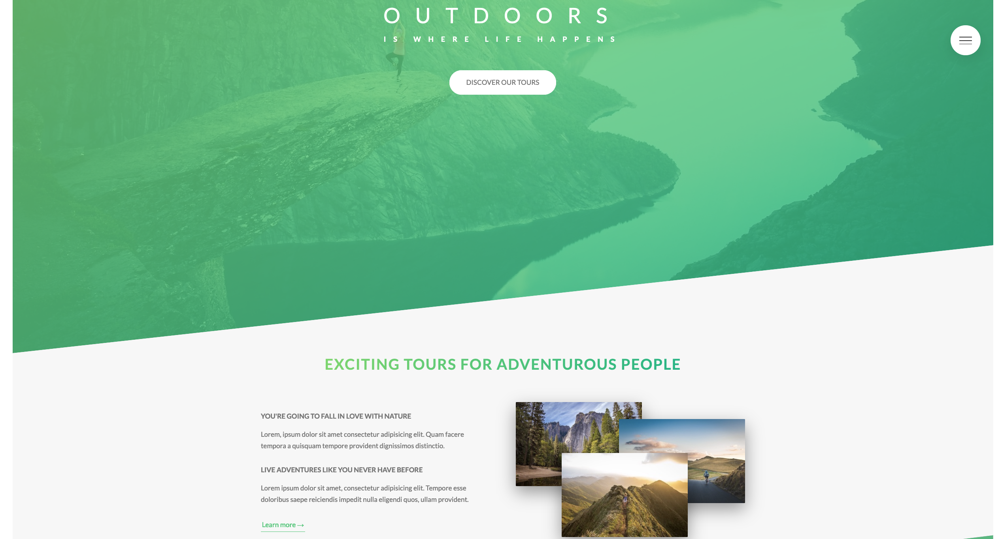
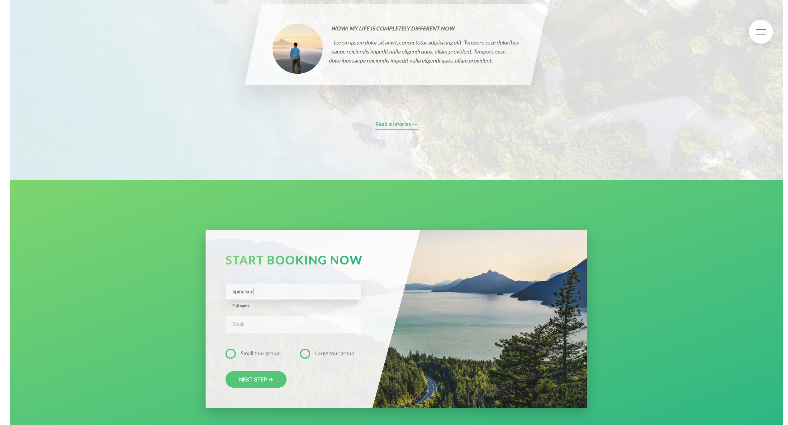
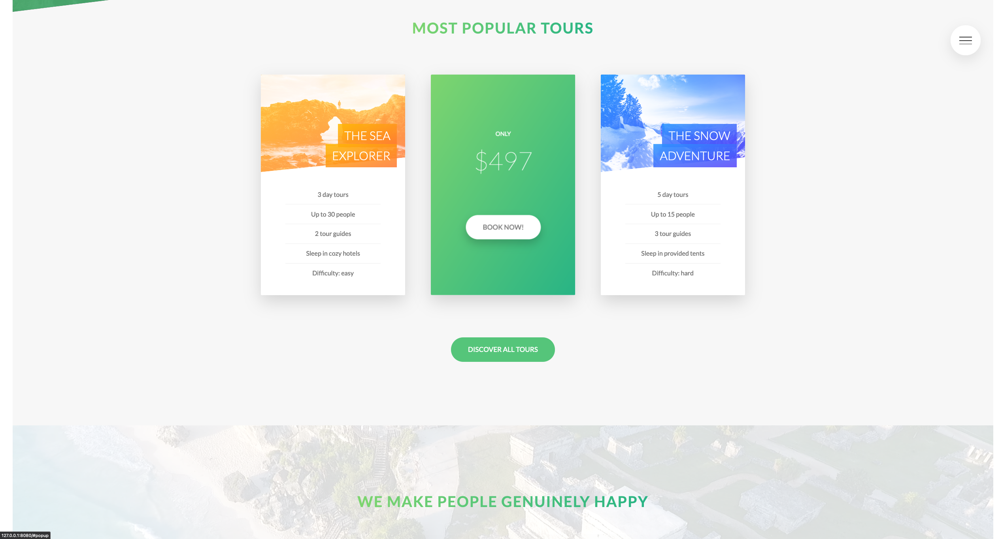

# Natours
I developed this site during a course I've taken in [advanced css and sass](https://www.udemy.com/course/advanced-css-and-sass/) on _Udemy_. 
It is made of 100% `css` and includes animations, responsive images, media queries much more.  
Enjoy exploring the code :mag:  

  
  

  

  

